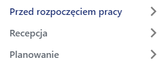
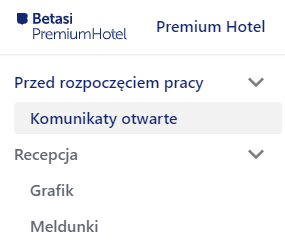
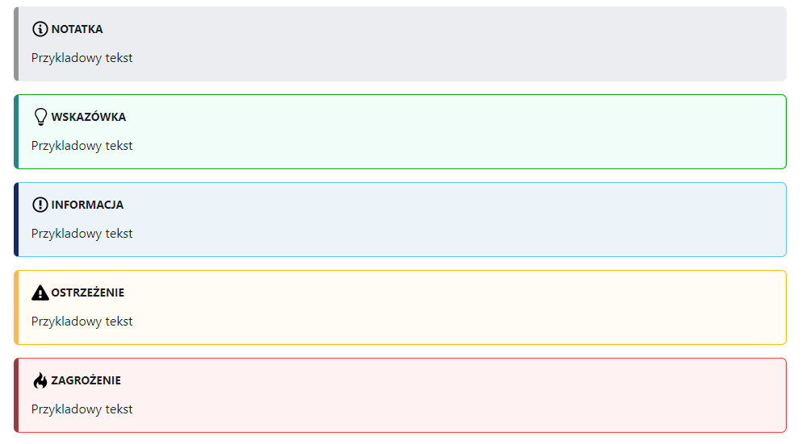
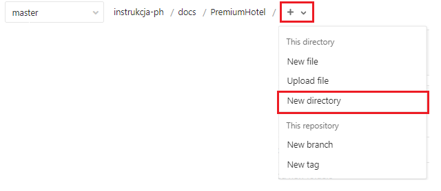
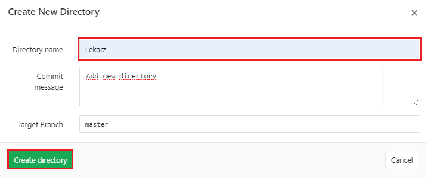
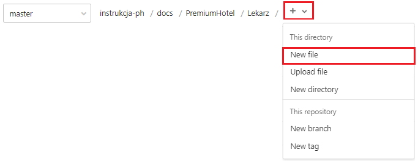
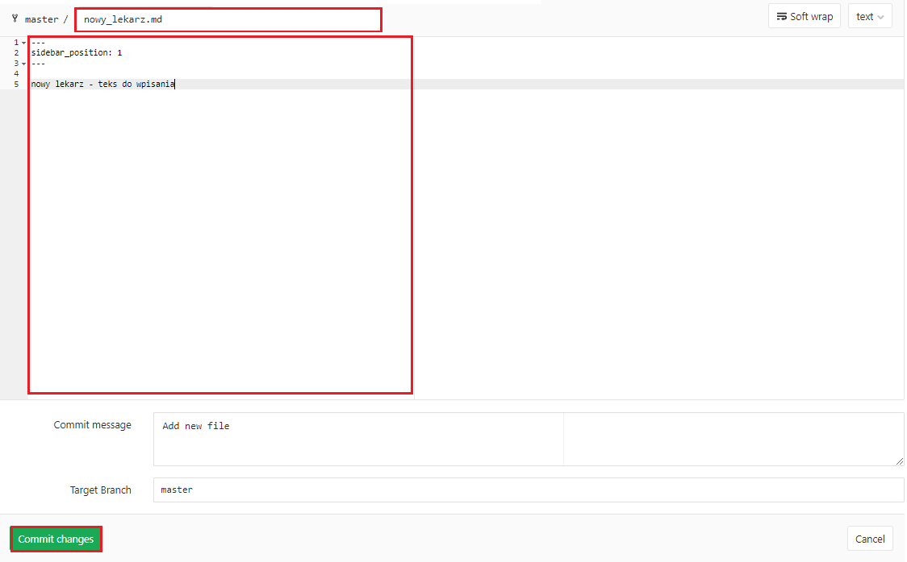
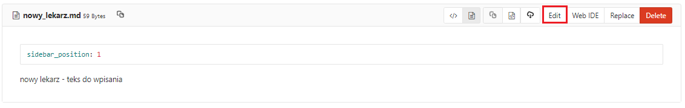
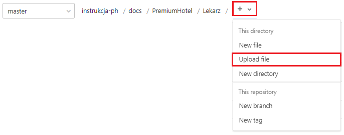

# **Instrukcja** 

1. Poszczególne foldery w `docs` odpowiadaja za zakładki, które są wyświetlane na stronie (menu górne)

    

2. Poszczególne podfoldery w `docs` odpowiadają za kategorie, wyświetlane na pasku nawigacyjnym (po lewej stronie)

    

3. W podfolderach znajdują się pliki z rozszerzeniem `.md` w których zawarta jest instrukcja dotycząca odpowiedniej kategorii
4. Kolejność kategorii ustalamy w `sidebars.js`,

    *Przydkład:*

    > dla struktury:
 
    

    > kod wygląda następująco:

    ```javascript
    PremiumHotel: [
        {
            type: 'category',
            label: 'Przed rozpoczęciem pracy',
            items: [{type: 'autogenerated', dirName: 'PremiumHotel/Przed rozpoczęciem pracy'}],
        },
        {
            type: 'category',
            label: 'Recepcja',
            items: [{type: 'autogenerated', dirName: 'PremiumHotel/Recepcja'}],
        },
    ],
    ```


    gdzie:

        
*  PremiumHotel - nazwa folderu w `docs` (załadka)

*  type - typ, może być kategoria (category) lub podkategoria, w przypadku większej liczby zagnieżdżeń (subcategory)

*  label - nazwa kategorii

*  items:
   
    * dirName - ścieżka do instrukcji znajdujących się w poszczególnych kategoriach

5. Kolejność instrukcji w kategoriach ustalamy w pliku z instrukcją z rozszezreniem `.md`:

    *Przydkład:*

    > ścieżka: `docs -> PremiumHotel -> Recepcja -> Meldunki.md`
    
    
    ```javascript
    ---
    sidebar_position: 2
    ---
    ```
6. Dodawanie elementów w instrukcji
*  nagłówki
    ```
    # nagłówek H1
    ## nagłówek H2
    ### nagłówek H3
    #### nagłówek H4
    ##### nagłówek H5
    ###### nagłówek H6
    ```
    

*  zdjęcia

    > Wszystkie zdjęcia umieszczamy odpowiednio w `static -> img -> nazwa_zakładki (np. PremiumHotel)`.
      Wywołanie zdjęcia w instrukcji: ``````

*  filmy
    > W pliku .md umieszczamy ```import YouTube from 'react-youtube';```. Następnie wywołujemy film ```<YouTube videoId="id" />```

*  linki
    > ```[nazwa_pod_jaką_widoczny_jest_link](/PremiumHotel/Planowanie/Zabiegi)```

*  alerty
    ```
    :::note Notatka
    
    Przykladowy tekst

    :::success

    :::tip Wskazówka

    Przykladowy tekst

    :::

    :::info Informacja

    Przykladowy tekst

    :::

    :::caution Ostrzeżenie

    Przykladowy tekst

    :::

    :::danger Zagrożenie

    Przykladowy tekst

    :::
    ```

    

## **Instrukcja z poziomu GIT** 
1. Dodawanie nowej kategorii
    > Aby dodać nową kategorię należy przejść do folderu `docs`, następnie wybrać zakładkę w której chcemy ją dodać np. `PremiumHotel`. Następnie wybieramy przycisk `+` oraz `New directory` z górnego menu na GIT
    
    

    > Nastepnie w oknie, które się automatycznie otworzy uzupełniamy pole `Directory name` nazwą nowej kategorii oraz zatwierdzamy przyciskiem `Create directory`

    
    
    > Nastepnie przechodzimy do pliku `sidebars.js` i definiujemy nową kategorię w zakładce wraz z kolejnością jej wyświetlenia (patrz powyżej:  Instrukcja punkt 4)

2. Dodawanie nowej instrukcji
    > Aby dodać nową instrukcję należy przejść do folderu `docs`, następnie wybrać zakładkę w której chcemy ją dodać np. `PremiumHotel` oraz kategorię np. `Lekarz`. Następnie wybieramy przycisk `+` oraz `New file` z górnego menu na GIT

    

    > Nastepnie w oknie, które się automatycznie otworzy uzupełniamy pole `File name` nazwą nowej instrukcji z rozszezreniem `.md`, wpisujemy instrukcje wraz z pozycją `sidebar_position` w pole tekstowe oraz zatwierdzamy przyciskiem `Commit changes`

    

3. Edytowanie instrukcji
    > Aby edytować instrukcję należy przejść do folderu `docs`, następnie wybrać zakładkę w której chcemy ją edytować np. `PremiumHotel`, kategorię `Lekarz` oraz instrukcję `nowy_lekarz.md`. Następnie wybieramy przycisk `Edit` znajdujący się przy nazwie instrukcji
   
    

    > Nastepnie w oknie, które się automatycznie otworzy dokonujemy edycji oraz zatwierdzamy przyciskiem `Commit changes`, tak jak to mialo miejsce w przypadku dodawania nowej instrukcji

4. Wgrywanie 
*  instrukcji
    > Aby wgrać nową instrukcję należy przejść do folderu z odpowiednią kategorią np. `docs -> PremiumHotel -> Lekarz`, następnie wybrać przycisk `+` oraz `Upload file` z górnego menu na GIT
   
    

    > Nastepnie w oknie, które się automatycznie otworzy wybieramy `click to upload`, nastepnie wybieramy zdjęcie z komputera oraz wybieramy `Otwórz` i `Upload file` 

*  zdjęcia
    > Aby wgrać zdjęcie do projektu, postępujemy tak samo jak w przypadku instrukcji z róznica w przypadku ścieżki. Ścieżka dla zdjęć to: `static -> img -> odpowiednia_kategoria`

5. Aktualizacja komentarzy przy edycji, bądź dodawaniu/usuwaniu zakładki, kategorii lub instrukcji
    > Jeśli chcemy zapisać kometarz do wykonanej przez nas czynności należy zmienić tekst w polu `Commit message` na dowolną przez nas nazwę


## **Zasady formatowania**

1. Z racji, że parametr `title` określony w każdym pliku .md, automatycznie jest nagłówkiem **h1**, w danym artykule używamy jedynie nagłówków **h2** i **h3**

    > *Przykład:*
    > ## Nagłówek h2
    > ### Nagłówek h3

2. Nazwy modułów, zakładek, kart i wyskakujących okien piszemy używając formatowania **bold**.

    > *Przykład:*  
    > Pokoje możemy edytować w zakładkach **Standardy** lub **Pokoje**

3. Nazwy przycisków, akcji, zaznaczonych opcji piszemy używając formatowania `code`.

    > *Przykład:*  
    > Jeżeli zaznaczymy opcję `Wolne w dniu`, wybierzemy odpowiednią datę i klikniemy przycisk `Pokaż`, to zobaczymy pokoje, które są wolne w danym dniu.

4. Przykłady prezentujemy za pomocą formatowania `blockquote`.

    > To jest przykład.

5. Alertów używamy do wyodrębnienia dodatkowych informacji lub ostrzeżeń.

6. Plik roboczy z listą wszystkich modułów i zakładek umieszczony jest w katalogu głównym repozytorium: `MODULES.md`. Prezentuje strukturę modułów i zakładek PremiumHotel w wersji 2021.06M i na jego bazie zbudowana jest struktura instrukcji.

7. Zdjęcia dodajemy w formacie PNG, szerokość najlepiej 958px, aby uniknąć przeskalowania, które pogorszy czytelność. Do robienia screenshotów można użyć windowsowego narzędzia **Wycinek i szkic**, korzystając z opcji **Wycinek okna**, które pozwala na precyzyjne wycięcie samego okna, które chcemy opisać.


//
winpty docker run -it --env-file=.env -e "CONFIG=$(cat ./config.json | jq -r tostring)" algolia/docsearch-scraper
